# <div align="center">BUDGET</div>

## Description

The project `BUDGET` is a single-page web application written using Vite and React with Typescript made to be simple and to make very easy to have control over financial resources.

- It's compatible with desktop and mobile devices.
- It supports english and brazilian portuguese.
- It has support for USD and BRL currencies.

It's a personal project made to trully be used and to serve to its purpuse.

## Getting Started

The following is recommended for the development environment:

1. Usage of [Visual Studio Code](https://code.visualstudio.com/) as IDE and the following plugins:
   - Prettier - Code formatter
   - ESLint
2. [Node.js](https://nodejs.org/en/download/)
3. [NPM](https://www.npmjs.com/)
4. [GIT](https://git-scm.com/)

## Technologies

<ul>
  <li><a href="https://nodejs.org/en/">Node.Js</a></li>
  <li><a href="https://www.typescriptlang.org/">Typescript</a></li>
  <li><a href="https://vitejs.dev/">Vite</a></li>
  <li><a href="https://reactjs.org/">React JS</a></li>
  <li><a href="https://redux-toolkit.js.org/">Redux Toolkit</a></li>
  <li><a href="https://www.npmjs.com/package/axios">Axios</a></li>
  <li><a href="https://www.npmjs.com/package/dotenv">Dotenv</a></li>
  <li><a href="https://react-icons.github.io/react-icons/">React-icons</a></li>
  <li><a href="https://react-redux.js.org/">React-redux</a></li>
  <li><a href="https://www.npmjs.com/package/redux-persist">Redux-persist</a></li>
  <li><a href="https://styled-components.com/">Styled-components</a></li>
  <li><a href="https://www.npmjs.com/package/validator">Validator</a></li>
</ul>

### Folder Structure

```
./budget/
 ├── vscode           - VSCode configutation files
 ├── public           - static and public files
 ├── src              - react code
   ├── app            - settings and files
   ├── budget         - project's main component and subcomponents
   ├── common         - reusable functions
   ├── currency       - currency settings
   ├── features       - reusable React components
   ├── language       - language settings
   ├── services       - services for external access
   └── themes         - themes settings
 ├── .editorconfig    - editorconfig configutation file
 ├── .eslintrc.cjs    - eslint configuration file
 ├── .gitignore       - ignore settings from git
 ├── .prettierrc.cjs  - prettier configuration file
 ├── tsconfig.json    - typescript configuration file
 └── README.md        - content of this file
```

## Notes

This is the front-end part of the project. The back-end must be running in a server for it to work.

Backend repo: <a href="https://github.com/aldair-gc/budget-backend.git">https://github.com/aldair-gc/budget-backend.git</a>

## Run

```
$ git clone https://github.com/aldair-gc/budget.git
$ npm install
$ npm run dev
```

Open in the browser http://localhost:5173

## Status

Ready.

## Features

- [x] Authentication
- [x] Help
- [x] Settings
- [x] UserAccess
- [x] Scroll Date Picker
- [ ] Transaction Folder
- [ ] Hide checked transactions
- [ ] Vibrate and sound when using Scroll Date Picker

## Demo

<h1 align="center">
  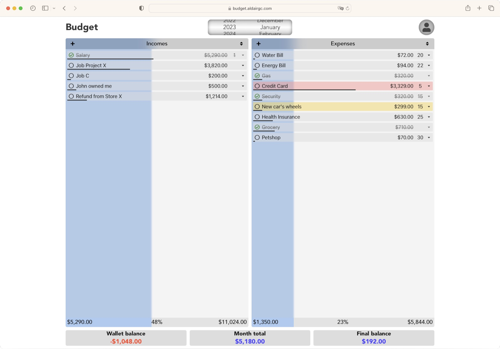
  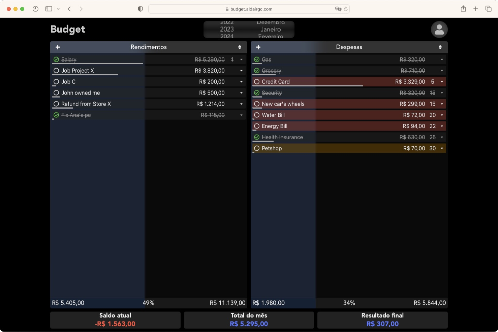
  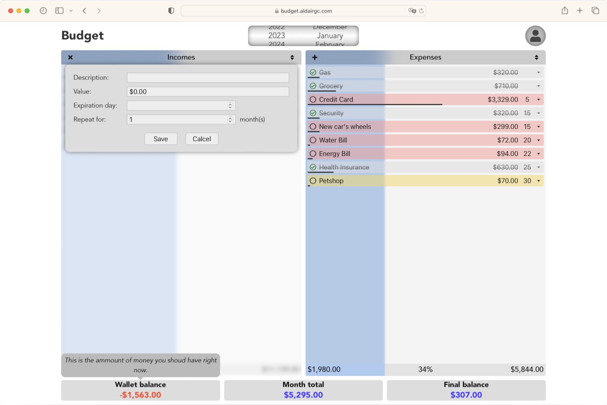
  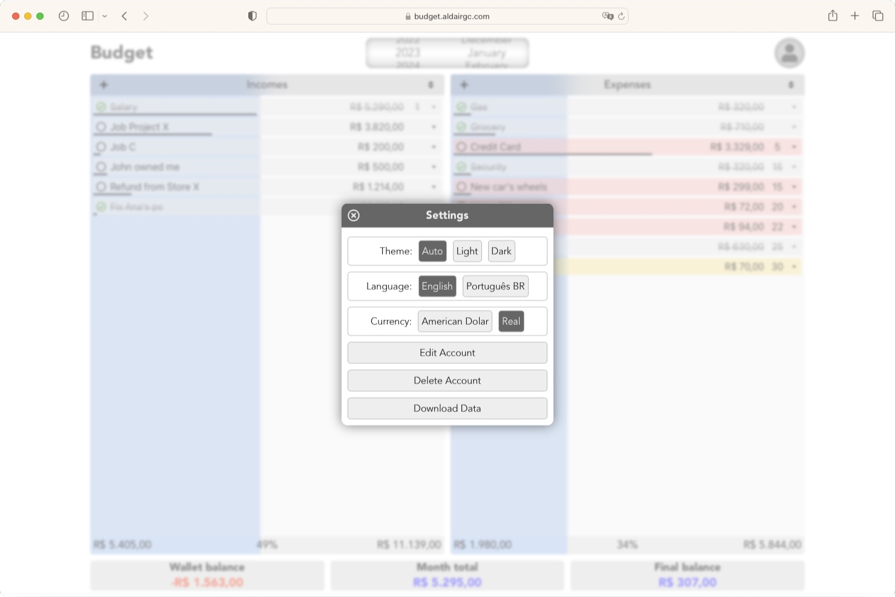
</h1>
<h1 align="center">
  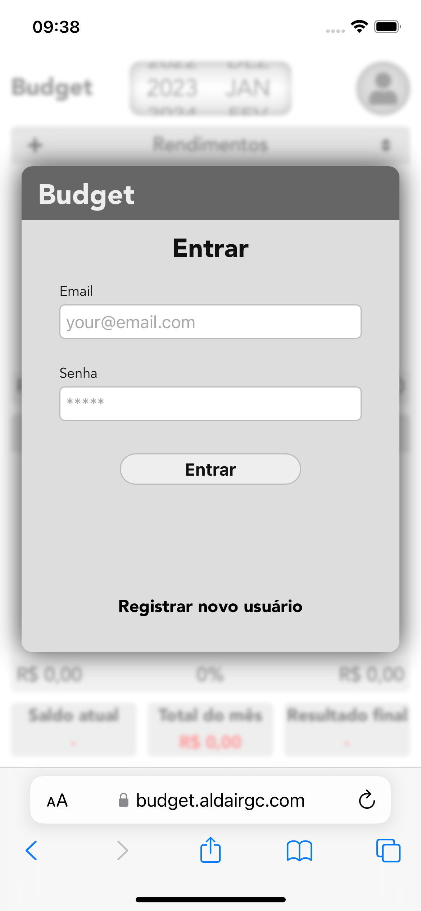
  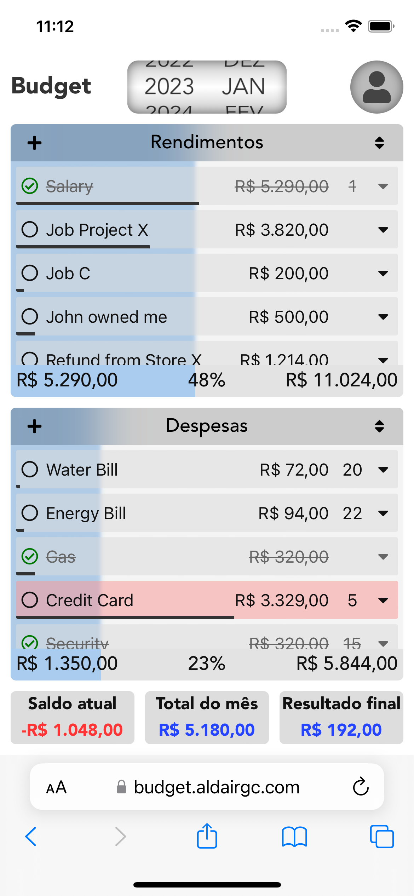
  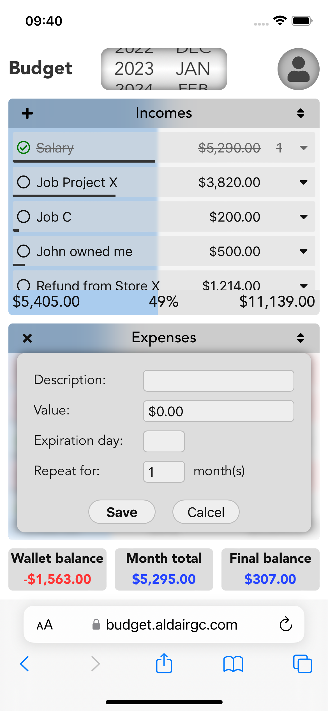
  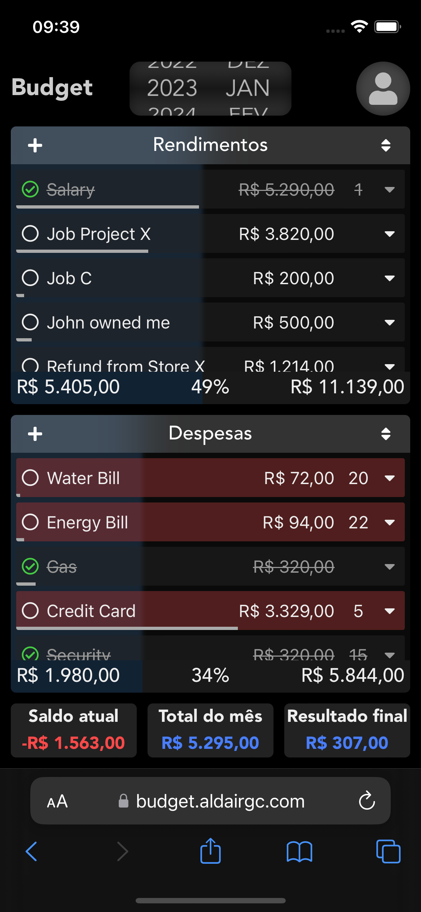
  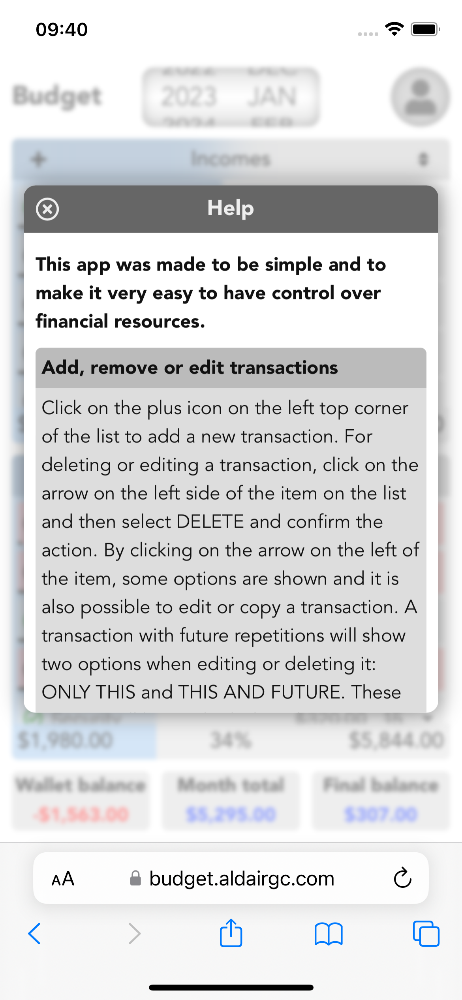
  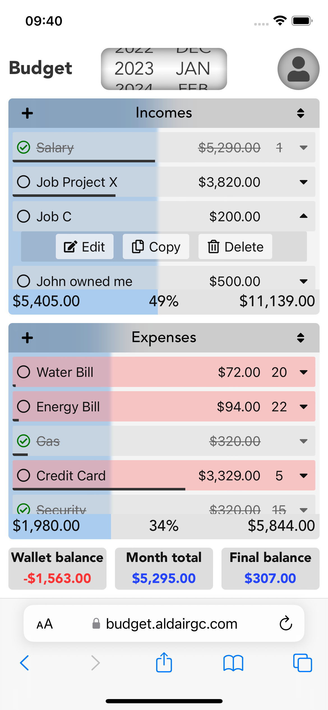
  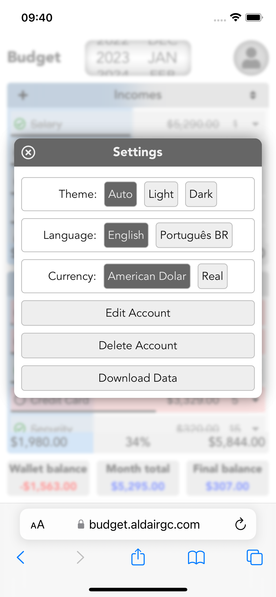
</h1>
